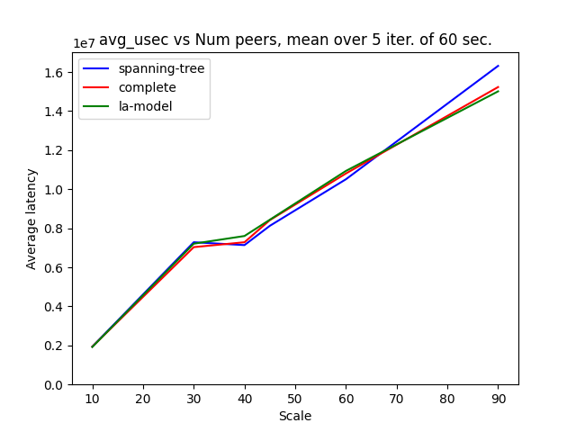
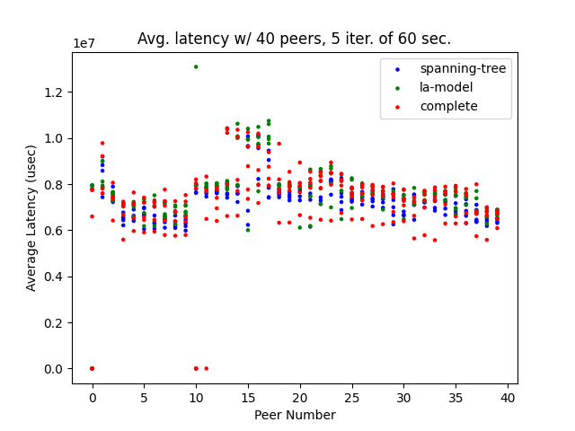

# Container Mesh testing for Ditto Small Peer

Test harness for p2p apps that operate in limited connectivity and/or
high-mobility environments, using the [Ditto](https://ditto.live) Rust SDK.

Test-driven development for challenging edge sync use cases. Peer-to-peer only.

## The Idea

Run a bunch of containers with an app based on Ditto's small peer SDK. The app
measures update latency and other system metrics.  Using containers makes it
easy to scale to large node counts on a single machine, and to introduce chaos
with Linux Traffic Control (tc) (via
[pumba](https://github.com/alexei-led/pumba)?) to simulate a degraded network,
high mobility, and other failure conditions.

## The Code

`docker/` container creation / running / management

&nbsp;&nbsp;&nbsp;`cmesh` main driver script. Run without arguments for usage.

*Rust Apps*

`peer/`

Peer application executes the test plan and reports results.
We run N of these via `docker/cmesh run <N>`

`coordinator/`

Coordinator application which provides peer discovery, test plan
generation, and coordination for peers.
We run 1 of these for each test.

`common/`

Common Rust definitions and logic used by `peer` and `coordinator`.

*Typescript App*
There is also a Typescript implementation of the cmesh-peer which uses the Ditto JS SDK.

`ts/`

### Building

Tested with `DITTO_TARGET=x86_64-unknown-linux-gnu`. Other architectures, for
now, are left as an exercise for the reader. See section *Running in your
environment* below for modifications you'll need to make to suit your
environment.

### Building for Distribution w/ Makefile

The [Makefile](./Makefile) builds the rust apps as well as the typescript peer,
and places them in the `./bin/` folder, e.g.:

```
FLAVOR=release make
```

Omit the `FLAVOR=release` to build debug binaries.

#### Building Rust Apps and Containers

For manual testing, you can build Rust apps separately. Keep in mind that the
test runner scripts will expect to see the executables in a `./bin` directory,
so you still need to run `make` before using them.

For *debug builds*:

```
cargo build --target $DITTO_TARGET
docker/cmesh build
```

For *release builds*:
```
cargo build --target $DITTO_TARGET --release
FLAVOR=release docker/cmesh build
```

### Running and Collecting Results

Run 20 peers:

`docker/cmesh run 20` for debug build or `FLAVOR=release docker/cmesh run 20` for release builds.

Tail all container logs:

`docker/cmesh watch`

Stop all cmesh containers:

`docker/cmesh stop`

Delete all container builds, etc., and stop all cmesh containers:

`docker/cmesh clean`

Test results

```
docker/cmesh ls     # list peer test results
docker/cmesh cat    # output all test results to stdout
docker/cmesh rm     # delete all test reports
```

#### Automated Iteration and Graph Plotting

There is a helper script that will run multiple iterations of the test and
collect output, which should allow you to do long-running tests, `test-loop.sh`.
A typical run looks like this:

```
for scale in 40 45 50 55; do ITERATIONS=5 SCALE=$scale scripts/test-loop.sh ; done

```

An hour or two later (depending on your args above):


```
cd perf-results
mkdir Graphs
../scripts/plot-results.py -o Graphs .
```

Some example graphs: First we have a plot of average update latency versus scale (number of peers). These are mean values reported by each peer, averaged over all peers and over all test iterations.



The second graph is a scatter plot which shows mean latency results reported by
each peer (x axis). Note the couple of red dots at the bottom; these zero
values indicate a failure, and are usually a sign that you've reached a scaling
limit.




### Running in Your Environment

#### Increasing OS Limits
*You will probably need to increase some system limits to run a large number of containers.*


##### ARP Cache Blowout
Once you start running a large number of containers, you may notice dmesg errors like this:

```
[5952197.195797] neighbour: arp_cache: neighbor table overflow!

```

Increase the following values, e.g.

```
sudo -e /etc/systcl.conf

# add these lines
net.ipv4.neigh.default.gc_thresh1 = 2048
net.ipv4.neigh.default.gc_thresh2 = 4096
net.ipv4.neigh.default.gc_thresh3 = 8192
```

Then apply the values: `sudo sysctl -p`

Note: For 100+ containers on a single host, you may need to double these values
again. If you have plenty of memory, try this:

```
net.ipv4.neigh.default.gc_thresh1 = 4096
net.ipv4.neigh.default.gc_thresh2 = 8191
net.ipv4.neigh.default.gc_thresh3 = 16384
```


##### If you use journald logging for Docker:

I use journald logging for docker, so I can read logs after containers
terminate for debugging. This required me to increase max inotify instances to
get around this error:

_journald: error initializing inotify watches: too many open files_

Increase this value in your `sysctl.conf` as above:

```
fs.inotify.max_user_instances = 512
```

#### Config Files

- .envrc    Environment variables needed for building peer and coordinator apps.
- .env      Non-secret vars to be set in containers at runtime.
- .secret.env   Secret vars needed by containers at runtime.

You'll need to create a file .secret.env that contains:

```
export DITTO_APP_ID="your Ditto app id"
```

For OfflinePlayground auth (current code):

```
export DITTO_LICENSE="your ditto license string"
```

For OnlinePlayround auth (currenly disabled):

```
export DITTO_PG_TOKEN="your playground token"
```

#### Other Architectures

I'm developing on Ubuntu 22.04 for target x86_64-unknown-linux-gnu
at the moment. To build this in your environment you'll need to modify .envrc.

If you want to build on / for another platform you'll need to:

Search / replace things like:
- x86_64
- libdittoffi.so (i.e. to .dylib)
- "/lib" for target library paths, i.e. in docker/run*.sh

# Typescript Peer

There is also a Typescript (JS SDK) peer implementaion in [/ts](./ts). This was
ported from the Rust implementation so we can compare the performance of this
SDK, and write instrumented test cases that take advantage of the distributed
test execution control provided by the coordinator.

The typescript implementation is written as a library you can include to create
your own test application. An example of a simple app which participates in a
cmesh test as a client is in [ts/src/index.ts](./ts/src/index.ts)

# Design & Notes (WIP)

### Metrics

We want to simulate peer-to-peer communication in bad networking environments,
which could be caused by:
    A. Interference and EW / Jamming
    B. High mobility nodes (frequent changes to mesh topology)
    C. Node failures.
    D. Low network bandwidth / high delay.
    .. etc.

Some metrics we'd like to collect:
- Message latency. Time between write of a value on peer_i to read of that value on peer_j.
- Resync latency. How long after losing connectivity can we catch up with current mesh state?
- Service availability. % of time we can read/write to ditto DB. (Should be near
  100%; one of our main our value props.)
- Link utilization: Would be nice to have timeseries data of the utilization of
  each active network link.
- Bandwidth savings: Versus a "resend full state on reconnect" model. Sender
  metrics would be nice, but could also calculate based on received deltas and
  their timestamps.

## Design

Start of with some simplifying assumptions:
- All containers run on same machine. For now, to make full control easier.
- All nodes (containers) have synchronized clocks. This makes event analysis
  and metrics easier.
- Timing:
    - Events will be stamped with node-local identifiers, including a timestamp.
    - Each peer will generate a write at least once a second. (to bound sync latency).

- A priori scenarios
    - Any test scenario plan can be loaded on the nodes before the test starts.

- Log collection and analysis
    - A. Use ditto.. Write logs there and analyze at end.
    - B. Write to external tracing sink.
    - C. Write to log files and collect at end of run.

## Work In Progress

Some TODOs:

- Small peer test app (agents).

    - [x] Basic operation with latency reports in peer logs

    - [x] Peer-to-peer bootstrapping

       - [x] Use well-known IP and "coordinator collection" to connect to
          coordinator and get CoordinatorInfo (heartbeat details + optional
          exec. plan)

    - [ ] calculate resync latency (bound on time to get full set of updates for
        some epoch)

- [x] fix [docker/cmesh](docker/cmesh) to allow spinning up huge sets of peers

- [ ] Add the chaos stuff; write tests that use pumba / tc to mess with the network.

- [ ] Use secrets instead of env. vars to pass license / app ID.
